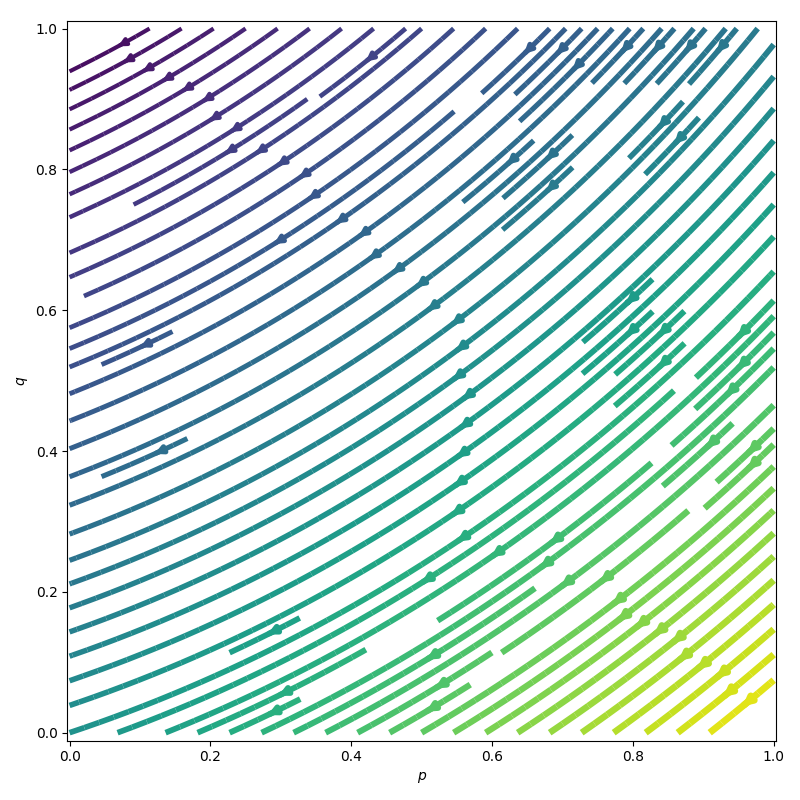
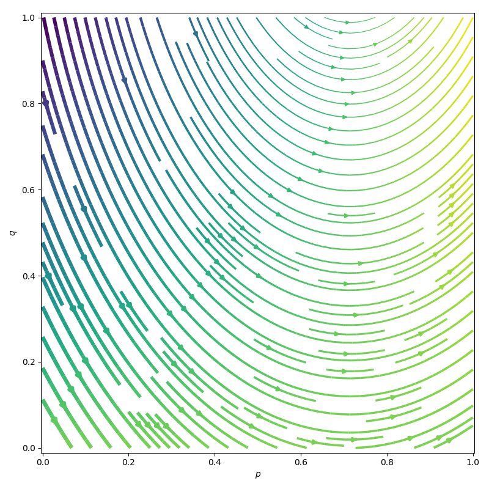
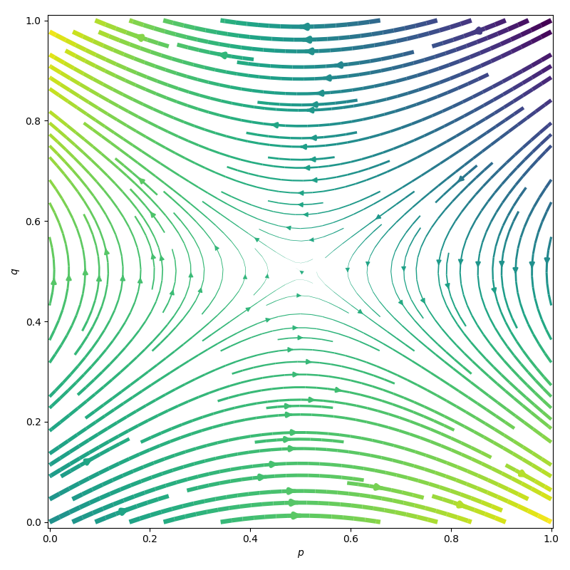
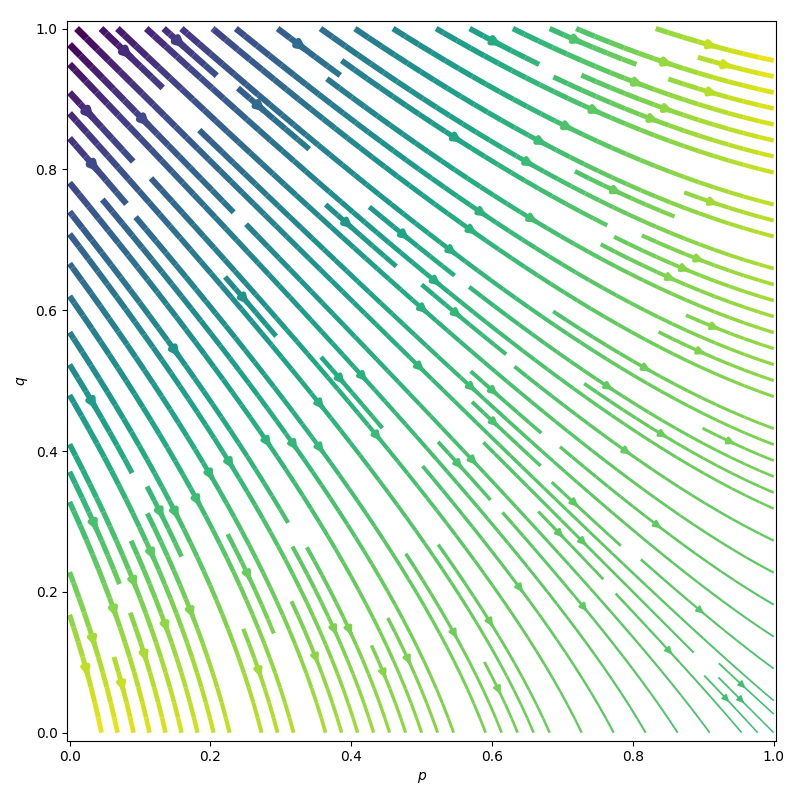
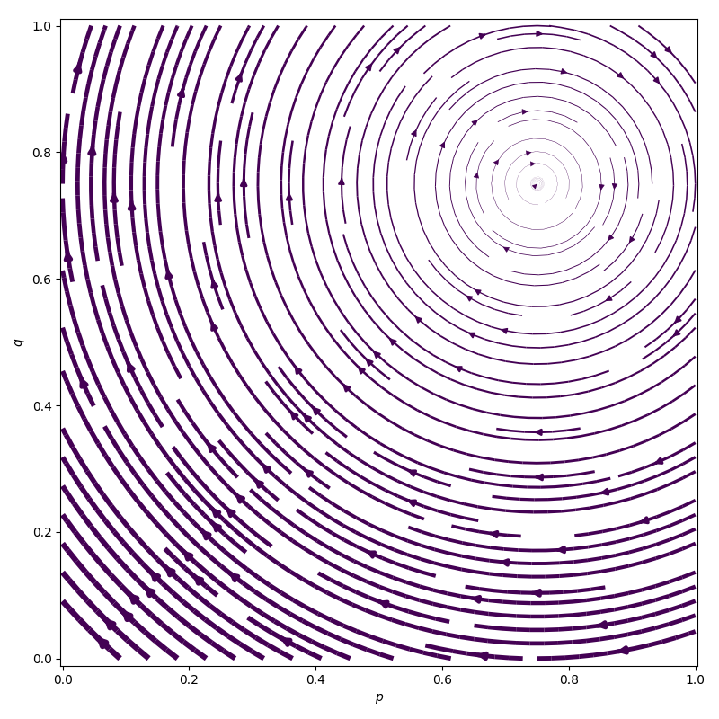

# Game theory

Result videos are shown in 12 fps. Simulations are run for up to 1000 steps (step size: 0.1 second). Frames are saved for the first 50 steps, and then taken quadratically. Early stopping is used if the system reaches a steady state for up to 5 steps. Contour lines are drawn from the Gaussian kernel density estimation of the distribution of the policy population. Click the images below to see the video.

## 6-31

## 6-32

## 6-33

## 6-37

## 6-38

