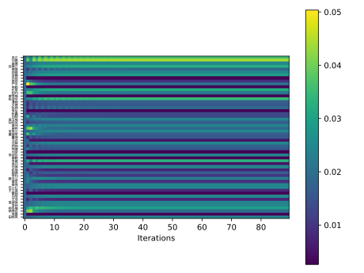

# PageRank

黄楠 · 1900012126 · 生命科学学院

## 导入依赖

```python
import numpy as np
import networkx as nx
import pandas as pd
from matplotlib import pyplot as plt
from matplotlib import font_manager

fontP = font_manager.FontProperties()
fontP.set_family("XHei NF")
fontP.set_size(4)
```

## 读取数据

```python
raw_data = pd.read_csv("data/desens.csv")
raw_data["认识的三位同学"] = raw_data["认识的三位同学"].str.split("; ")
raw_data.drop(columns=["序号"], inplace=True)
raw_data
```

## 统计人名

```python
_uniq_names = set()
for names in raw_data["认识的三位同学"]:
    _uniq_names.update(names)
for name in raw_data["你的姓名"]:
    _uniq_names.add(name)
uniq_names = list(_uniq_names)
uniq_names
```

## 构建邻接矩阵

```python
Adj = np.zeros((len(uniq_names), len(uniq_names)), dtype=bool)
for _from, _tos in raw_data[["你的姓名", "认识的三位同学"]].values:
    for _to in _tos:
        Adj[uniq_names.index(_from), uniq_names.index(_to)] = True

plt.imshow(Adj, cmap="gray")
plt.axis("off")
plt.tight_layout()
plt.savefig("image/AdjacencyMatrix.svg", transparent=True)
plt.show()
```


## PageRank

```python
def PageRank(ranks: np.ndarray, adj: np.ndarray, shrink: float):
    out = adj.sum(axis=0)
    # Avoid Division by Zero error
    out[out == 0] = 1
    # Update new values
    new_ranks = (adj / out[:, None]).T @ ranks
    # Shrink
    new_ranks *= shrink
    # Compensate
    new_ranks += (1 - shrink) / len(ranks)
    # Normalize
    new_ranks /= new_ranks.sum()
    return new_ranks


S = 0.85

last_ranks = np.zeros(len(uniq_names))
ranks = np.ones(len(uniq_names)) / len(uniq_names)
history: list[np.ndarray] = []

while not np.allclose(last_ranks, ranks):
    last_ranks = ranks
    history.append(ranks)
    ranks = PageRank(ranks, Adj, S)

history_image = np.stack(history, axis=0)

plt.imshow(history_image.T)
plt.xlabel("Iterations")
plt.yticks(range(len(uniq_names)), uniq_names, fontproperties=fontP)
plt.colorbar()
# plt.axis("off")
plt.tight_layout()
plt.savefig("image/PageRankIterations.svg", transparent=True)
plt.show()
```



## 与入度对比

```python
stable_ranks = ranks
in_degree = Adj.sum(axis=1)

fig, axs = plt.subplots(ncols=1, nrows=2, sharex=True, figsize=(5, 1))
axs[0].imshow(in_degree[None, :])
axs[0].set_yticks([0], ["In-Degree"])
axs[1].imshow(stable_ranks[None, :])
axs[1].set_yticks([0], ["PageRank"])
axs[1].set_xticks(range(len(uniq_names)), uniq_names, fontproperties=fontP, rotation=90)
plt.tight_layout()
plt.savefig("image/PageRankComparison.svg", transparent=True)
plt.show()
```


## 保存结果

```python
df = pd.DataFrame({"name": uniq_names, "in_deg": in_degree, "pagerank": stable_ranks})
df.to_csv("data/result.csv", index=False)
```

|   name | in_deg | pagerank              |
| -----: | :----: | :-------------------- |
| 王兰英 |   1    | 0.008543770176494705  |
|   高倩 |   1    | 0.024550596631593306  |
|   李娜 |   1    | 0.029731396537113635  |
| 滕玉兰 |   2    | 0.022968648641850914  |
|   徐欢 |   1    | 0.009586698354001107  |
| 唐建军 |   3    | 0.016331854496554846  |
|   李建 |   1    | 0.03350719946915862   |
| 娄淑英 |   1    | 0.024550596631593306  |
|   潘丽 |   2    | 0.01702293273954704   |
| 任小红 |   1    | 0.024550596631593306  |
| 张淑华 |   1    | 0.034879074845032214  |
| 孙桂英 |   1    | 0.01702293273954704   |
|   张帅 |   1    | 0.018789496634386463  |
| 曾雪梅 |   1    | 0.0028376938015348676 |
|   李东 |   1    | 0.0028376938015348676 |
|   雷丽 |   2    | 0.0028376938015348676 |
|   慕强 |   2    | 0.018789496634386463  |
|   苏岩 |   1    | 0.0028376938015348676 |
|   严平 |   2    | 0.02084092260773395   |
|   谢艳 |   2    | 0.01890127205625251   |
| 杨冬梅 |   1    | 0.02930191513211684   |
| 田桂英 |   1    | 0.024550596631593306  |
|   黄燕 |   1    | 0.024550596631593306  |
|   章颖 |   1    | 0.0028376938015348676 |
|   范辉 |   1    | 0.024550596631593306  |
|   李岩 |   1    | 0.024550596631593306  |
|   李利 |   1    | 0.010130034333181916  |
|   施璐 |   0    | 0.016791564974568903  |
|   杜军 |   2    | 0.03207826052363958   |
|   田丹 |   2    | 0.02163077828036422   |
|   覃军 |   1    | 0.009586698354001107  |
|   田明 |   1    | 0.01765482018565973   |
|   刘阳 |   1    | 0.012903624359725861  |
|   庞云 |   2    | 0.03607279662600699   |
|   董坤 |   2    | 0.015777525364079597  |
|   王浩 |   1    | 0.007652403470580652  |
|   张鑫 |   2    | 0.012994596536715721  |
|   邹博 |   2    | 0.015877554660746196  |
| 李秀兰 |   1    | 0.024550596631593306  |
|   赵瑜 |   1    | 0.007445697306683052  |
|   冯欢 |   3    | 0.005347390966165707  |
|   郑俊 |   1    | 0.024550596631593306  |
|   刘勇 |   3    | 0.0438928748476174    |
|   单颖 |   2    | 0.0028376938015348676 |
|   庞雷 |   1    | 0.0028376938015348676 |
|   范琳 |   1    | 0.024550596631593306  |
| 苏秀云 |   2    | 0.03207826052363958   |
|   艾建 |   3    | 0.015777525364079597  |
| 杨秀珍 |   2    | 0.019070550225703156  |
| 黄玉梅 |   1    | 0.024550596631593306  |
| 李淑珍 |   1    | 0.024550596631593306  |
|   刘荣 |   3    | 0.0028376938015348676 |
|   成丹 |   0    | 0.005347390966165707  |
|   刘芳 |   1    | 0.024550596631593306  |
|   黄伟 |   1    | 0.023812734443507053  |
