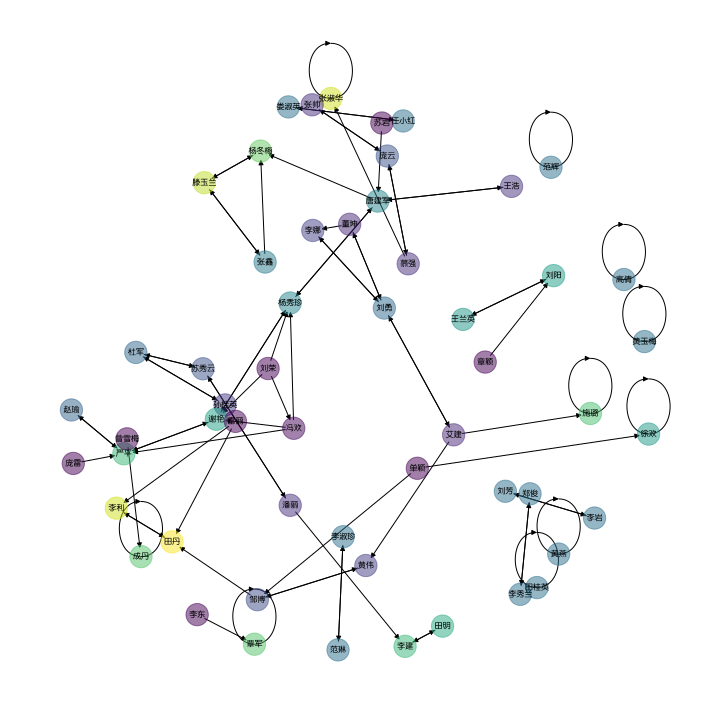

# PageRank

## 导入依赖

```python
import numpy as np
import networkx as nx
import pandas as pd
from matplotlib import pyplot as plt
from matplotlib import font_manager

fontP = font_manager.FontProperties()
fontP.set_family("XHei NF")
fontP.set_size(4)
```

## 读取数据

```python
raw_data = pd.read_csv("data/desens.csv")
raw_data["认识的三位同学"] = raw_data["认识的三位同学"].str.split("; ")
raw_data.drop(columns=["序号"], inplace=True)
raw_data
```

## 统计人名

```python
_uniq_names = set()
for names in raw_data["认识的三位同学"]:
    _uniq_names.update(names)
for name in raw_data["你的姓名"]:
    _uniq_names.add(name)
uniq_names = list(_uniq_names)
uniq_names
```

## 构建邻接矩阵

```python
Adj = np.zeros((len(uniq_names), len(uniq_names)), dtype=bool)
for _from, _tos in raw_data[["你的姓名", "认识的三位同学"]].values:
    for _to in _tos:
        # Removing self loop
        if _from != _to:
            Adj[uniq_names.index(_from), uniq_names.index(_to)] = True

# Add self loop to those nodes without any out edge
Adj += np.diag(np.where(Adj.sum(axis=1) == 0, True, False))

plt.imshow(Adj, cmap="gray")
plt.axis("off")
plt.tight_layout()
plt.savefig("image/AdjacencyMatrix.svg", transparent=True)
plt.show()
```


## PageRank

```python
def PageRank(ranks: np.ndarray, adj: np.ndarray, shrink: float):
    # Calculate out degree
    out = adj.sum(axis=1)
    # Update new values
    new_ranks = (adj / out[:, None]).T @ ranks
    # Shrink
    new_ranks *= shrink
    # Compensate
    new_ranks += (1 - shrink) / len(ranks)
    # Normalize
    new_ranks /= new_ranks.sum()
    return new_ranks


S = 0.85

last_ranks = np.zeros(len(uniq_names))
ranks = np.ones(len(uniq_names)) / len(uniq_names)
history: list[np.ndarray] = []

while not np.allclose(last_ranks, ranks):
    last_ranks = ranks
    history.append(ranks)
    ranks = PageRank(ranks, Adj, S)

history_image = np.stack(history, axis=0)

plt.imshow(history_image.T)
plt.xlabel("Iterations")
plt.yticks(range(len(uniq_names)), uniq_names, fontproperties=fontP)
plt.colorbar()
plt.tight_layout()
plt.savefig("image/PageRankIterations.svg", transparent=True)
plt.show()
```


## 与入度对比

```python
stable_ranks = ranks
in_degree = Adj.sum(axis=0)

fig, axs = plt.subplots(ncols=1, nrows=2, sharex=True, figsize=(5, 1))
axs[0].imshow(in_degree[None, :])
axs[0].set_yticks([0], ["In-Degree"])
axs[1].imshow(stable_ranks[None, :])
axs[1].set_yticks([0], ["PageRank"])
axs[1].set_xticks(range(len(uniq_names)), uniq_names, fontproperties=fontP, rotation=90)
plt.tight_layout()
plt.savefig("image/PageRankComparison.svg", transparent=True)
plt.show()
```


## 保存结果

```python
df = pd.DataFrame({"name": uniq_names, "in_deg": in_degree, "pagerank": stable_ranks})
df.to_csv("data/result.csv", index=False)
```

|   name | in_deg | pagerank             |
| -----: | :----: | :------------------- |
|   李娜 |   1    | 0.018019216977279526 |
|   庞云 |   2    | 0.02179564480847977  |
|   李利 |   1    | 0.024567802961716907 |
|   冯欢 |   3    | 0.015013632902204267 |
| 唐建军 |   3    | 0.03459929630846835  |
|   覃军 |   0    | 0.015013632902204267 |
| 孙桂英 |   1    | 0.010633184419410701 |
| 曾雪梅 |   2    | 0.015013632902204267 |
| 张淑华 |   0    | 0.012219619932335949 |
|   郑俊 |   1    | 0.015013632902204267 |
|   张鑫 |   2    | 0.010584690085340957 |
|   谢艳 |   2    | 0.0466812108012528   |
|   范辉 |   1    | 0.015013632902204267 |
|   邹博 |   2    | 0.02343277926335196  |
|   苏岩 |   2    | 0.015013632902204267 |
|   雷丽 |   3    | 0.015013632902204267 |
|   单颖 |   3    | 0.015013632902204267 |
|   黄燕 |   1    | 0.015013632902204267 |
|   徐欢 |   0    | 0.015013632902204267 |
|   严平 |   2    | 0.04718500611927747  |
|   范琳 |   1    | 0.015013632902204267 |
| 杨秀珍 |   2    | 0.046501425949819576 |
|   庞雷 |   2    | 0.015013632902204267 |
| 黄玉梅 |   1    | 0.015013632902204267 |
|   赵瑜 |   1    | 0.012362767093956993 |
| 杨冬梅 |   1    | 0.028807986586766688 |
| 任小红 |   1    | 0.015013632902204267 |
| 李淑珍 |   1    | 0.015013632902204267 |
|   黄伟 |   1    | 0.02043679564979044  |
|   王浩 |   1    | 0.012145950150205085 |
| 苏秀云 |   2    | 0.01939408138499783  |
|   杜军 |   2    | 0.01939408138499783  |
| 田桂英 |   1    | 0.015013632902204267 |
| 王兰英 |   1    | 0.013364991284717588 |
|   成丹 |   0    | 0.015013632902204267 |
|   艾建 |   3    | 0.009879388285263448 |
|   张帅 |   1    | 0.011622626949066513 |
|   李岩 |   1    | 0.015013632902204267 |
| 滕玉兰 |   2    | 0.019276365391777763 |
|   李东 |   2    | 0.015013632902204267 |
|   刘阳 |   1    | 0.026025321052530987 |
|   施璐 |   0    | 0.010783423748208206 |
|   高倩 |   1    | 0.015013632902204267 |
|   刘芳 |   1    | 0.015013632902204267 |
| 娄淑英 |   1    | 0.015013632902204267 |
|   董坤 |   2    | 0.009879388285263448 |
|   刘荣 |   4    | 0.015013632902204267 |
|   田明 |   1    | 0.011114200099978    |
|   刘勇 |   3    | 0.02634645240701867  |
|   李建 |   1    | 0.020561707321917214 |
|   潘丽 |   2    | 0.010633184419410701 |
| 李秀兰 |   1    | 0.015013632902204267 |
|   章颖 |   2    | 0.015013632902204267 |
|   慕强 |   2    | 0.011622626949066513 |
|   田丹 |   1    | 0.03478796137322544  |

## 网络可视化

```python
G: nx.DiGraph = nx.from_numpy_array(Adj, create_using=nx.DiGraph)
pos = nx.spring_layout(G, k=5 / np.sqrt(G.order()), iterations=75, seed=2023)

fig = plt.figure(figsize=(10, 10))
nx.draw_networkx_nodes(G, pos, node_color=stable_ranks, alpha=0.5, node_size=500)
nx.draw_networkx_edges(G, pos)
nx.draw_networkx_labels(
    G,
    pos,
    labels={i: name for i, name in enumerate(uniq_names)},
    font_size=8,
    font_family="XHei NF",
)
plt.axis("off")
plt.tight_layout()
plt.savefig("image/GraphVisualization.svg", transparent=True)
plt.show()
```



## GitHub 仓库链接

[TeddyHuang-00/Computational-Thinking-in-Social-Sciences](https://github.com/TeddyHuang-00/Computational-Thinking-in-Social-Sciences/tree/pagerank-social-network)
